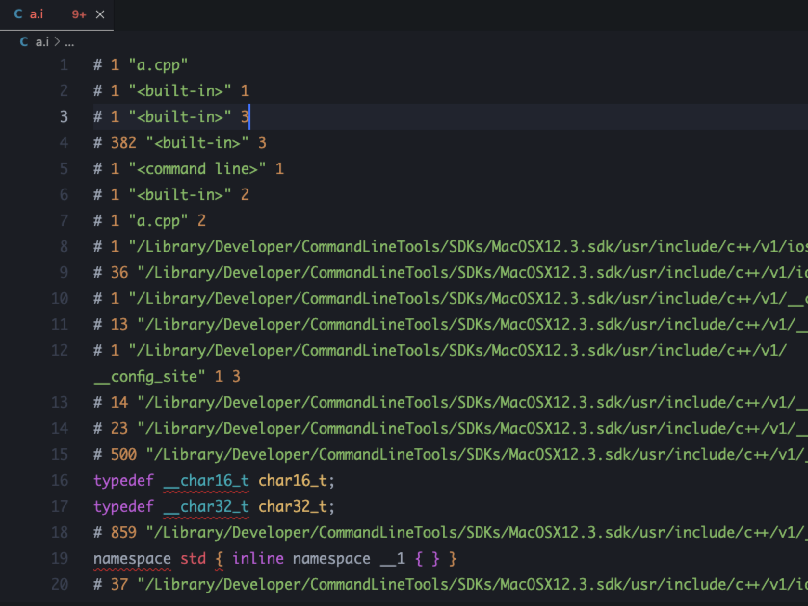
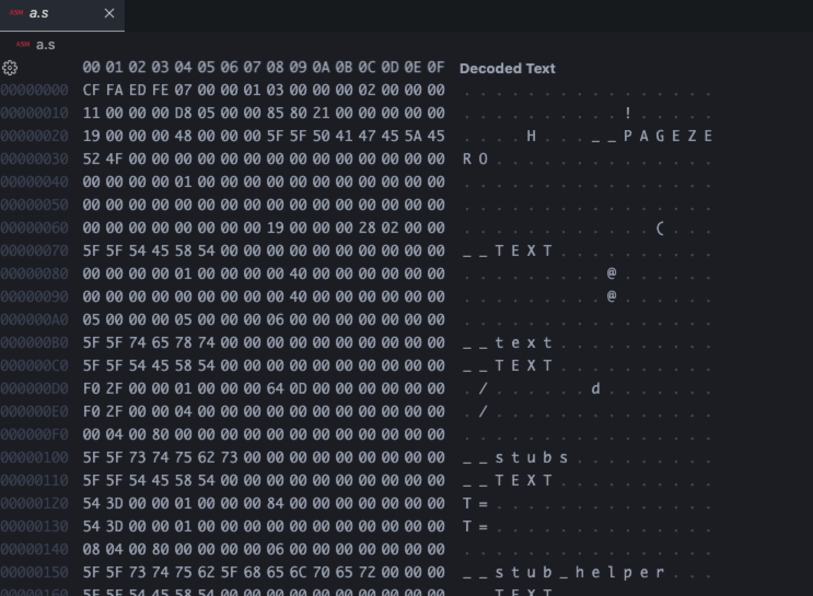
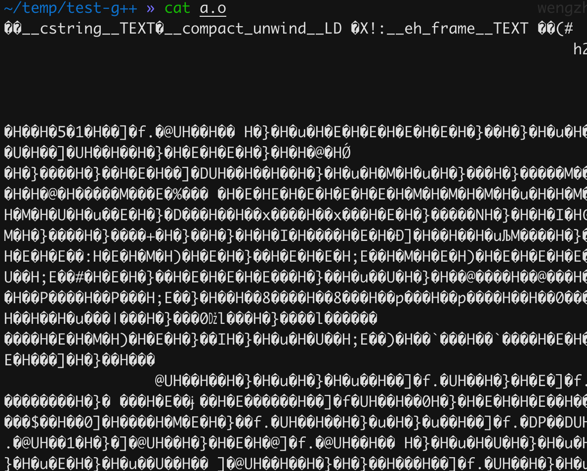
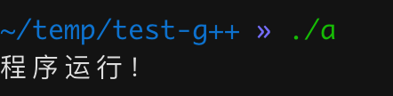

## g++

`g++`是`gcc`中的一个工具。专门来编译`c++`。

### 编译过程

编译阶段，`g++`会调用`gcc`，链接阶段，通常由`g++`完成。整个过程分为四个步骤：

1. 预处理，生成`.i`文件
2. 编译，将预处理后的文件（`.i`）转换成汇编语言，生成`.s`文件
3. 汇编，将汇编文件（`.s`）汇编成二进制文件（`.o`）
4. 链接，将不同的库（`.o`）链接到引用该库的源程序（`.o`）中

下面以这个文件为例：

```c++
#include "iostream"
using namespace std;

int main(int argc, char const *argv[])
{
  cout << "程序运行！" << endl;
  return 0;
}
```

### -E

```bash
g++ -E a.cpp -o a.i
```

预处理阶段主要做了以下事项：

1. 替换宏
2. 消除注释
3. 将`.h`文件插入对应的`.cpp`文件

执行完上述指令，生成了`a.i`文件：



### -s

```bash
g++ -s a.i -o a.s
```

生成汇编文件：



### -c

```bash
g++ -c a.cpp -o a.o
```

生成机器码：



### -o

```bash
g++ a.o -o a
```

链接目标代码，生成可执行程序：



链接分为静态链接和动态链接。

静态链接是在编译阶段直接引入引用的库，和程序打包在一起。

动态链接是在编译阶段不引入引用的库，而在执行阶段引入。这样可以随时更新库而不影响程序，也能减少程序的体积。